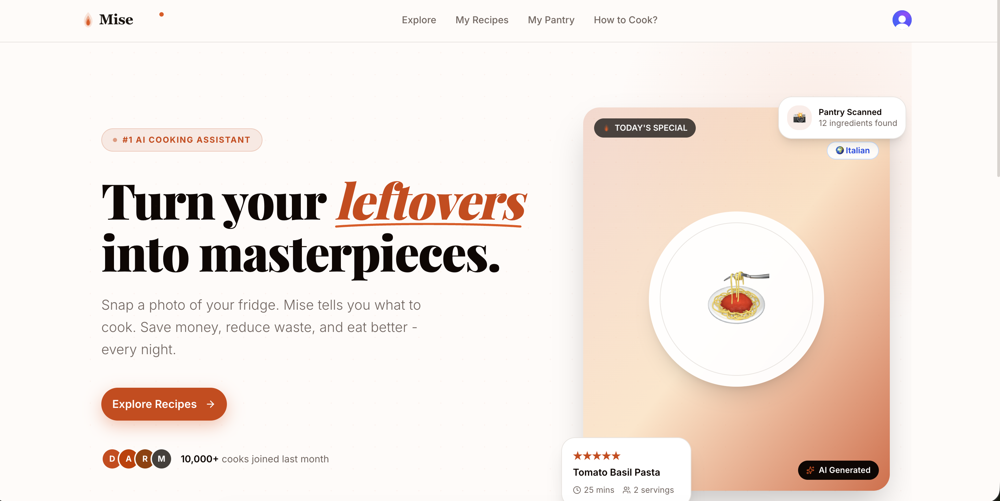

<div align="center">

  <!-- Replace with your actual banner/landing page screenshot -->
  

  <br />
  <br />

  

  # Mise — AI Recipe Platform

  **Turn your leftovers into masterpieces.**

  An AI-powered full-stack recipe SaaS built with Next.js 15, PostgreSQL, OpenAI, and Google Gemini Vision.

  <br />

  [](https://mise.vercel.app)
  [](https://github.com/Deepak-patidar-a/mise)
  [](https://nextjs.org)
  [](https://typescriptlang.org)

</div>

---

## What is Mise?

Mise is a production-grade AI recipe platform that helps users discover, generate, and save recipes based on what they already have in their fridge. Snap a photo of your pantry — Mise identifies the ingredients, suggests personalised recipes, and generates full step-by-step cooking instructions powered by AI.

The name comes from the French culinary term **"mise en place"** — having everything prepared and in its place before you cook.

---

## Screenshots

> *Add your screenshots here — explore page, recipe detail, pantry scanner, mobile view*

| Explore Page | Recipe Detail | Pantry Scanner |
|---|---|---|
|  |  |  |

---

## Key Features

**AI Pantry Scanner**
Upload a photo of your fridge or pantry — Google Gemini Vision API identifies up to 20 ingredients with confidence scores. Results are reviewed before saving to your personal pantry.

**AI Recipe Generation**
Enter any recipe name and OpenAI GPT-4o-mini generates a complete recipe with step-by-step instructions, ingredient quantities, chef tips, substitutions, and nutrition info. Generated recipes are cached in PostgreSQL — subsequent requests are served from DB instantly at no API cost.

**Pantry-Based Suggestions**
Select your pantry ingredients and get 5 AI-generated recipe suggestions ranked by match percentage. Each suggestion shows which ingredients you have and what you're missing.

**World Recipe Explorer**
Browse 50,000+ real recipes from the MealDB database organised by category and world cuisine. Each recipe links to a full detail page with ingredients, instructions, and an embedded YouTube tutorial.

**Save to Collection**
Save any recipe — whether MealDB or AI-generated — to your personal collection. Accessible from the My Recipes page with full detail view.

**Rate Limiting**
Free users get 3 AI recipe generations and 3 pantry scans per day. Pro users get unlimited access. Enforced server-side using Upstash Redis sliding window rate limiting.

---

## Tech Stack

### Frontend
| Technology | Usage |
|---|---|
| Next.js 15 (App Router) | Framework, server components, routing, ISR |
| TypeScript | Strict typing throughout |
| Tailwind CSS v4 | Styling with custom warm theme |
| Shadcn UI | Component library (Dialog, Badge, Tabs, Card) |
| React Query | Client-side data fetching and caching |
| Zustand | Client state management |
| Lucide React | Icon library |

### Backend & Database
| Technology | Usage |
|---|---|
| Next.js API Routes + Server Actions | Backend logic, mutations |
| PostgreSQL (Neon Serverless) | Primary database |
| Prisma v7 ORM | Database client, migrations, type safety |
| Upstash Redis | Rate limiting (sliding window) |

### AI & External APIs
| Technology | Usage |
|---|---|
| OpenAI GPT-4o-mini | Recipe generation, pantry suggestions |
| Google Gemini Vision | Pantry image scanning and ingredient detection |
| MealDB API | 50,000+ real recipe database |
| Unsplash API | High-quality food photography for generated recipes |
| Clerk | Authentication, user management |

### DevOps
| Technology | Usage |
|---|---|
| Vercel | Deployment, serverless functions |
| GitHub Actions | CI/CD |
| Neon | Serverless PostgreSQL hosting |

---

## Architecture Highlights

### Server vs Client Components
Every component is carefully classified — server components handle data fetching directly from the database (no API round trip, no loading state), client components handle interactivity. The boundary is explicit and intentional throughout the codebase.

```
Server Component (page.tsx)     Client Component (RecipeFilters.tsx)
├── Fetches from DB directly     ├── useState for search input
├── Passes data as props    →    ├── React Query for filtered results
└── No JavaScript sent to browser└── Optimistic UI for save/unsave
```

### Data Flow for AI Recipe Generation
```
User requests recipe by name
        ↓
Server Action checks PostgreSQL (cache hit → instant response)
        ↓
Cache miss → Rate limit check via Upstash Redis
        ↓
OpenAI GPT-4o-mini generates structured JSON recipe
        ↓
Unsplash API fetches relevant food photo
        ↓
Recipe saved to PostgreSQL as public (shared cache for all users)
        ↓
Returned to client with isSaved, isPro status
```

### Database Schema

```prisma
User          — Clerk auth sync, subscription tier
Recipe        — AI generated + public sharing + saved collection
PantryItem    — Per-user ingredient storage
SavedRecipe   — Junction table (userId + recipeId, @@unique)
```

### Rate Limiting Strategy
```
Free tier:   3 recipe generations/day  (prefix: mise:recipe_generation)
             3 pantry scans/day        (prefix: mise:pantry_scan_free)
             5 pantry suggestions/day  (prefix: mise:pantry_suggestions)

Pro tier:    Unlimited generations
             50 pantry scans/day
             Unlimited suggestions
```

---

## Project Structure

```
src/
├── app/
│   ├── (auth)/                    # Clerk auth pages
│   │   ├── sign-in/[[...sign-in]]/
│   │   └── sign-up/[[...sign-up]]/
│   └── (main)/                    # App pages
│       ├── explore/               # MealDB recipe browser
│       │   ├── [id]/              # Recipe detail (server component)
│       │   ├── category/[category]/
│       │   └── cuisine/[cuisine]/
│       ├── recipe/                # AI recipe generation page
│       ├── recipes/               # Saved recipes collection
│       ├── pantry/                # Pantry management
│       │   └── recipes/           # AI pantry suggestions
│       └── how-to-cook/           # Recipe search page
├── components/
│   ├── ui/                        # Shadcn components
│   ├── RecipeCard.tsx             # Multi-variant card (grid/pantry/list)
│   ├── MealDetailPage.tsx         # MealDB recipe detail
│   ├── AddToPantryModal.tsx       # AI scan + manual add
│   └── ImageUploader.tsx          # Drag & drop with camera capture
├── lib/
│   ├── db.ts                      # Prisma singleton client
│   └── actions/
│       ├── recipe.actions.ts      # AI generation, save/unsave
│       ├── pantry.actions.ts      # CRUD + Gemini scan
│       └── user.actions.ts        # Clerk → DB sync
├── types/
│   ├── recipe.ts                  # MealDBRecipe, DBRecipe, PantryRecipe
│   └── pantry.ts                  # PantryItem, PantryResult
└── constants/
    ├── navigation.ts
    ├── home.ts
    └── data.ts                    # Category emojis, country flags
```

---

## Getting Started

### Prerequisites
- Node.js 18+
- PostgreSQL database (or Neon account)
- Clerk account
- OpenAI API key
- Google AI Studio API key (Gemini)
- Upstash Redis database
- Unsplash API key

### Installation

```bash
# Clone the repository
git clone https://github.com/Deepak-patidar-a/mise.git
cd mise

# Install dependencies
npm install

# Set up environment variables
cp .env.example .env
# Fill in your API keys (see Environment Variables section below)

# Run database migrations
npx prisma migrate dev

# Generate Prisma client
npx prisma generate

# Start development server
npm run dev
```

Open [http://localhost:3000](http://localhost:3000) to see the app.

### Environment Variables

```env
# Database (Neon PostgreSQL)
DATABASE_URL=postgresql://...?sslmode=require
DATABASE_URL_UNPOOLED=postgresql://...?sslmode=require

# Clerk Authentication
NEXT_PUBLIC_CLERK_PUBLISHABLE_KEY=pk_test_...
CLERK_SECRET_KEY=sk_test_...
NEXT_PUBLIC_CLERK_SIGN_IN_URL=/sign-in
NEXT_PUBLIC_CLERK_SIGN_UP_URL=/sign-up
NEXT_PUBLIC_CLERK_SIGN_IN_FALLBACK_REDIRECT_URL=/
NEXT_PUBLIC_CLERK_SIGN_UP_FALLBACK_REDIRECT_URL=/

# AI APIs
OPENAI_API_KEY=sk-...
GEMINI_API_KEY=...

# Rate Limiting (Upstash Redis)
UPSTASH_REDIS_REST_URL=https://...
UPSTASH_REDIS_REST_TOKEN=...

# Image (Unsplash)
UNSPLASH_ACCESS_KEY=...
```

---

## Design System

Custom warm editorial theme built on Tailwind CSS v4 with `oklch` color space:

```css
--primary:    oklch(0.58 0.19 38)   /* Warm orange #E8520A */
--background: oklch(0.99 0.005 60)  /* Warm cream  #FDFAF7 */
--foreground: oklch(0.14 0.02 45)   /* Near black  #1A1410 */
```

Typography uses **Playfair Display** for headings (editorial, food-forward) and **Inter** for body text.

---

## What I Learned Building This

**Next.js 15 App Router** — deeply understood the server/client component boundary, when to use `async` components, how `loading.tsx` and `error.tsx` work as automatic Suspense boundaries, and the `params` as Promise change in Next.js 15.

**Prisma v7** — navigated the breaking changes from older versions (URL config moved to `prisma.config.ts`, new import paths, driver adapter pattern for Neon serverless).

**AI Integration Patterns** — built a cache-first pattern for expensive AI calls, implemented retry logic with model fallbacks for Gemini overload scenarios, and learned to engineer prompts for consistent structured JSON output.

**Production Security** — server-side rate limiting, ownership verification on mutations, API key isolation on server only (no `NEXT_PUBLIC_` prefix), proper error handling that doesn't leak internals to clients.

---

## Roadmap

- [ ] Stripe subscription for Pro tier
- [ ] Recipe PDF download
- [ ] Meal planning calendar
- [ ] Social sharing for recipes
- [ ] Nutritional tracking dashboard
- [ ] Mobile app (React Native)

---

## Author

**Deepak Patidar** — Full-Stack Engineer

[](https://linkedin.com/in/deepak-patidar)
[](https://github.com/Deepak-patidar-a)
[](https://your-portfolio.com)
[](mailto:deepakpatidar796@gmail.com)

---

<div align="center">

Built with ❤️ and a lot of ☕ | Star ⭐ this repo if you found it useful

</div>
